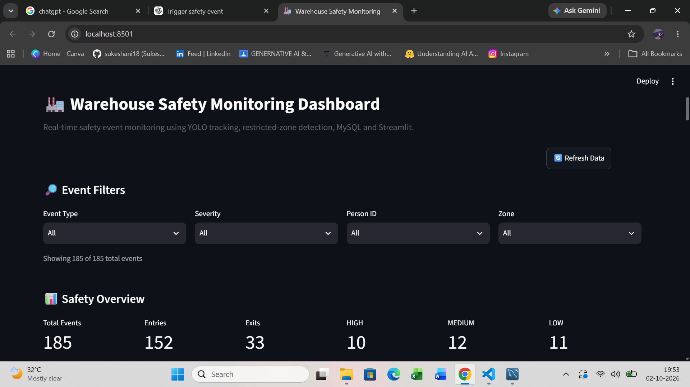
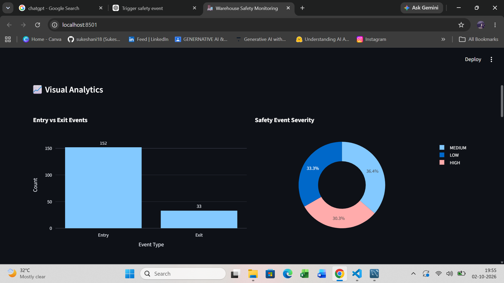
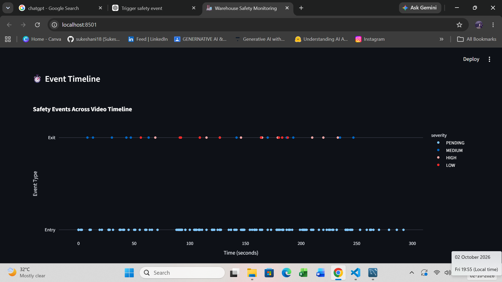
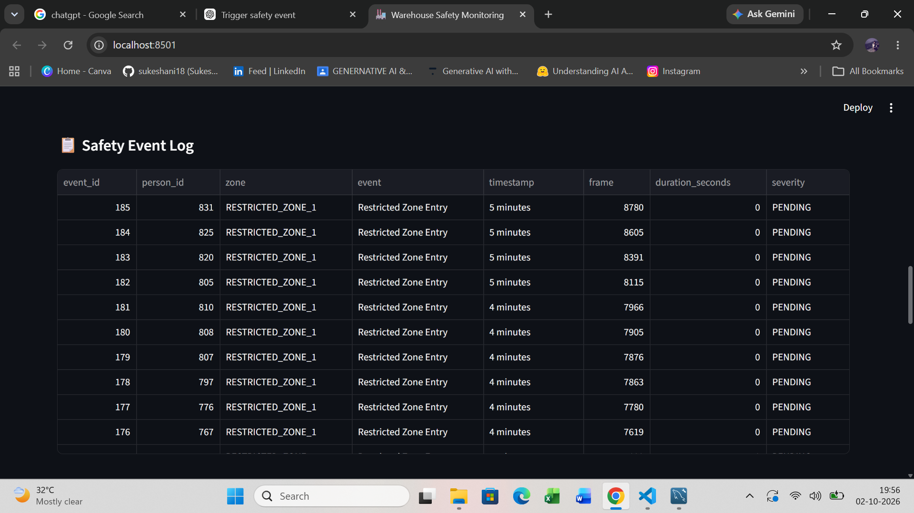
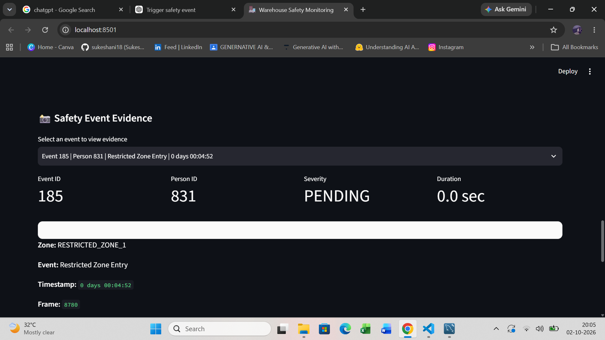
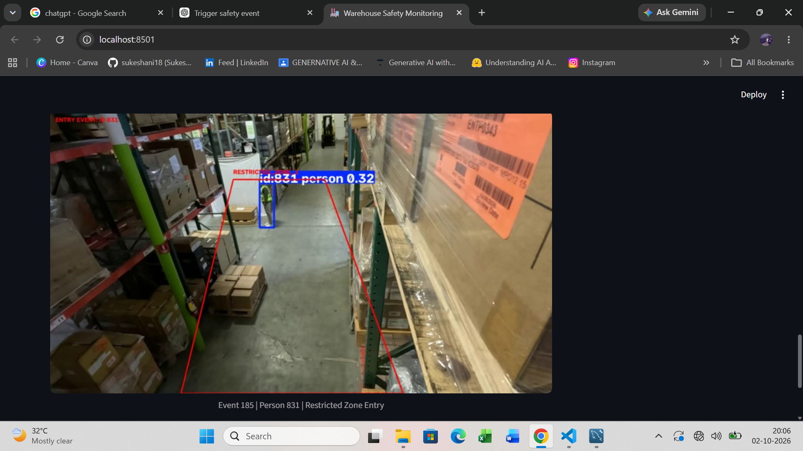

# Real-Time Warehouse Safety Monitoring System Using YOLO

A computer vision-based warehouse safety monitoring system that detects and tracks people in a defined restricted zone, identifies entry and exit events, calculates violation duration, assigns severity levels, stores evidence, and provides a MySQL-backed Streamlit dashboard for monitoring safety events.

## 📌 Project Overview

Warehouse environments can contain restricted areas where unauthorized entry may create safety risks.

This project uses **YOLO object detection and ByteTrack tracking** to monitor people in a warehouse video. A predefined polygonal restricted zone is used to detect when a tracked person enters or exits the area.

The system automatically records:

* Person ID
* Restricted zone
* Entry and exit events
* Timestamp
* Video frame number
* Violation duration
* Severity level
* Evidence image

The generated safety events are stored in **CSV and MySQL**, and a **Streamlit dashboard** is used to analyze and review the events.

## 🎯 Objectives

* Detect people in warehouse video
* Track individual people using unique IDs
* Define and monitor a restricted zone
* Detect zone entry and exit
* Calculate time spent inside the restricted zone
* Classify event severity based on duration
* Capture visual evidence
* Store safety events in a database
* Provide an interactive monitoring dashboard

## 🏗️ System Architecture

```text
Warehouse Video
       ↓
YOLO Person Detection
       ↓
ByteTrack Object Tracking
       ↓
Person ID Assignment
       ↓
Restricted Zone Detection
       ↓
Entry / Exit Detection
       ↓
Duration Calculation
       ↓
Severity Classification
       ↓
Evidence Image
       ↓
CSV Event Log
       ↓
MySQL Database
       ↓
Streamlit Dashboard
```

## 🔧 Technologies Used

| Technology       | Purpose                            |
| ---------------- | ---------------------------------- |
| Python           | Application development            |
| Ultralytics YOLO | Person detection                   |
| ByteTrack        | Object tracking                    |
| OpenCV           | Video processing and visualization |
| NumPy            | Polygon and numerical operations   |
| Pandas           | Event data processing              |
| MySQL            | Safety event database              |
| MySQL Connector  | Python–MySQL connection            |
| Streamlit        | Dashboard development              |
| Plotly           | Interactive charts                 |

## 📂 Project Structure

```text
Warehouse_Safety_Monitoring/
│
├── Input/
│   └── cam_00.mp4
│
├── models/
│   └── yolo11n.pt
│
├── database/
│   └── safety_events_full.csv
│
├── output/
│   ├── warehouse_safety_full.mp4
│   └── events/
│       └── safety event evidence images
│
├── main.py
├── test-mysql.py
├── app.py
└── README.md
```

## ⚙️ Main Components

### 1. Person Detection

YOLO is used to detect people in the warehouse video.

The system currently processes the **person class** for safety monitoring.

### 2. Person Tracking

ByteTrack assigns a unique tracking ID to detected people.

This allows the system to determine whether the same person remains inside or leaves the restricted area.

### 3. Restricted Zone

A polygon is manually defined within the warehouse video.

The person's bottom-center point is used to determine whether the person is inside the restricted zone.

### 4. Entry and Exit Detection

The system monitors the person's zone status across frames.

An event is generated when the tracked person's status changes:

```text
Outside → Inside = Entry
Inside → Outside = Exit
```

Duplicate events are avoided while the person remains inside the zone.

### 5. Duration Calculation

When a person exits the restricted zone, the system calculates how long the person remained inside.

### 6. Severity Classification

The project uses duration-based severity rules:

```text
Less than 2 seconds    → LOW
2–5 seconds            → MEDIUM
More than 5 seconds    → HIGH
Entry without exit     → PENDING
```

### 7. Evidence Capture

The system saves an image when a safety event occurs.

Evidence images are stored in:

```text
output/events/
```

### 8. MySQL Database

Safety events are imported into the MySQL database:

```text
Database: warehouse_safety
Table: safety_events
```

Stored information includes event ID, person ID, zone, event type, timestamp, frame, duration, severity, and evidence filename.

### 9. Streamlit Dashboard

The dashboard provides:

* Total event count
* Entry count
* Exit count
* Severity statistics
* Event filters
* Person filtering
* Zone filtering
* Interactive Entry vs Exit chart
* Severity chart
* Event timeline
* Safety event table
* Evidence image viewer
* Data refresh option

## 📊 Dashboard

The dashboard connects directly to MySQL and allows safety events to be filtered and reviewed interactively.

### Dashboard Features

```text
MySQL
  ↓
Streamlit
  ↓
Filters
  ↓
KPIs
  ↓
Interactive Charts
  ↓
Event Timeline
  ↓
Evidence Viewer
```

## ▶️ How to Run

### 1. Install dependencies

```bash
pip install ultralytics opencv-python numpy pandas mysql-connector-python streamlit plotly
```

### 2. Run the warehouse monitoring system

```bash
python main.py
```

This processes the warehouse video and generates the output video, CSV event log, and evidence images.

### 3. Import events into MySQL

Run:

```bash
python test-mysql.py
```

Make sure the MySQL database and `safety_events` table are configured correctly.

### 4. Start the dashboard

```bash
streamlit run app.py
```

The Streamlit dashboard will open in the browser.

## 📁 Output

The system generates:

### Processed Video

```text
output/warehouse_safety_full.mp4
```

### Event CSV

```text
database/safety_events_full.csv
```

### Evidence Images

```text
output/events/
```

### Database

```text
MySQL
└── warehouse_safety
    └── safety_events
```
## 📸 Project Screenshots

### 🖥️ Dashboard

The Streamlit dashboard provides an overview of warehouse safety events with KPIs, filters, and monitoring information.



### 📊 Analytics

Interactive charts and the event timeline provide a visual view of safety events and their severity.




### 🚨 Safety Event Evidence

The evidence viewer allows individual safety events to be selected and their captured evidence image to be reviewed.



### 🎯 YOLO Detection & Tracking

YOLO detects people in the warehouse video while ByteTrack assigns tracking IDs. The restricted zone is monitored for entry and exit events.




## 🔍 Current Scope

The current implementation focuses on **person detection and restricted-zone safety monitoring**.

PPE detection such as helmets or safety vests is not included because the current YOLO model does not contain dedicated PPE classes.

## 🚀 Future Improvements

Possible future extensions include:

* RTSP/live camera input
* Multiple restricted zones
* More advanced safety rules
* Automated alert notifications
* Historical reporting
* Additional warehouse analytics
* Deployment on an edge device

## 💡 Key Learning Outcomes

This project demonstrates practical experience with:

* Computer vision
* Object detection
* Object tracking
* Video processing
* Rule-based event detection
* Event logging
* Database integration
* Data visualization
* Streamlit dashboard development
* End-to-end AI application development

⭐ This project demonstrates an end-to-end workflow from video-based object detection to database storage and interactive safety monitoring.
